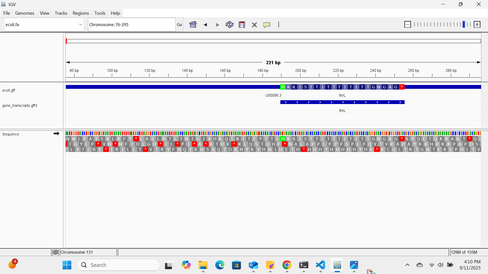

# Assignment for Week 3

## Answers to Questions

## Genome Size and Features

The genome is 4641652 base pairs long. 
    wget https://ftp.ensemblgenomes.ebi.ac.uk/pub/bacteria/current/fasta/bacteria_0_collection/escherichia_coli_str_k_12_substr_mg1655_gca_000005845/dna/Escherichia_coli_str_k_12_substr_mg1655_gca_000005845.ASM584v2.dna.toplevel.fa.gz
    gunzip Escherichia_coli_str_k_12_substr_mg1655_gca_000005845.ASM584v2.dnatoplevel.fa.gz
    mv Escherichia_coli_str_k_12_substr_mg1655_gca_000005845.ASM584v2.dnatoplevel.fa ecoli.fa
    wget https://ftp.ensemblgenomes.ebi.ac.uk/pub/bacteria/current/gff3/bacteria_0_collection/escherichia_coli_str_k_12_substr_mg1655_gca_000005845/Escherichia_coli_str_k_12_substr_mg1655_gca_000005845.ASM584v2.62.gff3.gz
    gunzip Escherichia_coli_str_k_12_substr_mg1655_gca_000005845.ASM584v2.62.gff3.gz
    mv Escherichia_coli_str_k_12_substr_mg1655_gca_000005845.ASM584v2.62.gff3 ecoli.gff
    grep "##sequence-region" ecoli.gff
    
Features 
    grep -v '^#' ecoli.gff | cut -f3 | sort | uniq -c | sort -nr

Output
    4558 exon
    4242 mRNA
    4242 CDS
    4240 gene
    179 ncRNA_gene
    115 pseudogenic_transcript
    115 pseudogene
    99 biological_region
    86 tRNA
    71 ncRNA
    22 rRNA
    1 chromosome

## Separate Gene and Transcript Intervals 

    grep -v '^#' ecoli.gff | awk '$3=="gene" || $3 ~ /transcript/' > gene_transcripts.gff3
    cut -f3 gene_transcripts.gff3 | sort | uniq -c

## Visualization of the simplified GFF file

Since the simplified file only contains genes/transcripts there are open spaces on the track. Those open spaces would account for anything that is NOT annotated as a gene or a transcript. In the case of E. coli, many of these regions were annotated as "chromosome." It is much easier to see distinct genes on the simplified GFF file.

## Image of IGV Session

In the image, you can see the "fish bones" running left to right for the gene thrL. On the sequence track, the arrow is also pointing to the right, so the sequences are running in the same direction. The gene, thrL, starts with a start codon (methionine) and ends with a stop codon. 

    

