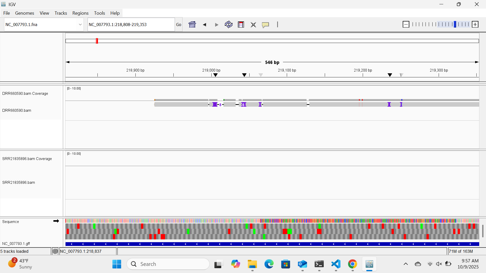
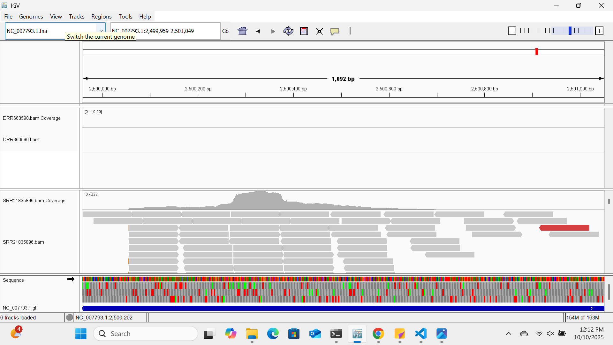

# Assignment for Week 7

## How to run the Makefile

The pipeline was expanded from week 6 to include steps to create a temporary bedgraph file and convert the bedgraph file to a bigWig file. To perform just those steps, run the following codes:

## Generate temporary bedgraph file

This step generates a temporary bedgraph file from a BAM file.

    make bam_to_bedgraph

## Turn bedgraph file into a bigWig file

This step turns the bedgraph file into a bigWig file.

    make bedgraph_to_bigwig

## Use Samtools depth 

This step calculates the area of the genome with the highest coverage using the BAM file.

    make depth

## Run the entire Makefile

The entire Makefile can be run by using the code:

    make run
	
## Customization

This code can be customized to run another SRR (from a different sequencing platform) by editting the corresponding variables at the top of the Makefile. For this assignment, sequencing data (SRR=SRR21835896) obtained using Illumina NovaSeq 6000. The sequencing data (SRR=DRR660590) was obtained from Oxford Nanopore (MinION). Even though this sequencing data is under a DRR number instead of an SRR number, simply changing the variables will still work. 

    SRR=DRR660590
    
## Answers to Questions

## Differences between the alignments

Two screenshots of the IGV sessions are shown below. The Nanopore reads are much longer with lower coverage. The lower coverage is partially due to the small subset of reads downloaded. The Nanopore dataset also contains purple lines/blocks on the track, which I believe represent supplementary alignments. 

The Illumina reads are shorter but have a higher coverage. The snapshot below shows the gene with the highest coverage, which is indicated by a higher peak. I believe the red colored blocks are mismatches or SNPs compared to the reference genome.  

## Statistics 

The output of the alignment statisitics for the SRR21835896 dataset can be found here:

    Output
    2001 + 0 in total (QC-passed reads + QC-failed reads)
    2000 + 0 primary
    0 + 0 secondary
    1 + 0 supplementary
    0 + 0 duplicates
    0 + 0 primary duplicates
    1997 + 0 mapped (99.80% : N/A)
    1996 + 0 primary mapped (99.80% : N/A)
    2000 + 0 paired in sequencing
    1000 + 0 read1
    1000 + 0 read2
    1984 + 0 properly paired (99.20% : N/A)
    1996 + 0 with itself and mate mapped
    0 + 0 singletons (0.00% : N/A)
    0 + 0 with mate mapped to a different chr
    0 + 0 with mate mapped to a different chr (mapQ>=5)

The output of the alignment statistics for the DRR660590 can be found here:

    Output
    15 + 0 in total (QC-passed reads + QC-failed reads)
    10 + 0 primary
    0 + 0 secondary
    5 + 0 supplementary
    0 + 0 duplicates
    0 + 0 primary duplicates
    15 + 0 mapped (100.00% : N/A)
    10 + 0 primary mapped (100.00% : N/A)
    0 + 0 paired in sequencing
    0 + 0 read1
    0 + 0 read2
    0 + 0 properly paired (N/A : N/A)
    0 + 0 with itself and mate mapped
    0 + 0 singletons (N/A : N/A)
    0 + 0 with mate mapped to a different chr
    0 + 0 with mate mapped to a different chr (mapQ>=5)

In both datasets, the subset of reads downloaded are all QC-passed reads. The data obtained using Illumina (SRR21835896)mapped at 99.8%, whereas the data obtained from Oxford Nanopore (DRR660590) mapped at 100%. This difference is extremely small, and likely due to variation in read lengths between the two instruments. There were more supplementary reads in the Oxford Nanopore dataset, but this is likely because the reads lengths are longer leading to read splitting. 

## Primary alignments

Based on the outputs shown above, the data obtained using Illumina (SRR21835896) had 2000 primary reads and the data obtained using Oxford Nanopore (DRR660590) had 10 primary reads. For both datasets, since there is a +0 next to the primary reads, it means that there were no QC-failed reads. The Illumina dataset has more primary reads because there a larger number of shorter reads, whereas the Nanopore reads are longer so there are less reads. 

## Coordinate with Largest Observed Coverage

Using samtools depth, the coordinate with the largest coverage in the DRR660590 BAM file is NC_007793.1, 1978315 with a depth of 2. The depth means how many reads overlapped at this position. 

    Output
    NC_007793.1     1978315 2

The coordinate with the largest coverage in the SRR21835896 BAM file is NC_007793.1, 2500331 with a depth of 222. The difference in the depths makes sense, as Oxford Nanopore has fewer reads than Illumina. More reads could be downloaded to provide additional insights.

    Output
    NC_007793.1     2500331 222

## Gene of Interest

There were not very many annotated genes on the GFF file, so what I decided to do was search for the function of one of the coding sequences in the area of highest coverage (shown above in the IGV image from the Illumina dataset.) I searched the following protein ID WP_000389956.1 in NCBI and determined that it is a multispecies 50S ribosomal protein L17. 

To determine the exact coordinates of the gene, I used the code:

    grep "cds-WP_000542274.1" NC_007793.1.gff
    
    Output
    NC_007793.1     Protein Homology        CDS     2357438 2357806 .       -       0       ID=cds-WP_000542274.1;Parent=gene-SAUSA300

The output shows that the start coordinate is 2,357,438 and the end coordinate is 2,357,806. To determine how many reads were on the forward stand, I used the code below. The -F 16 means to exclude the reverse-strand reads. 

    samtools view -c -F 16 SRR21835896.bam NC_007793.1:2357438-2357806

After running this code, I got an output of zero. Meaning that there are no reads on the forward strand. When I changed the code to exclude forward-strand reads, I got an output of 1, meaning that there was one read on the reverse-strand.

    samtools view -c -f 16 SRR21835896.bam NC_007793.1:1229595-1230521