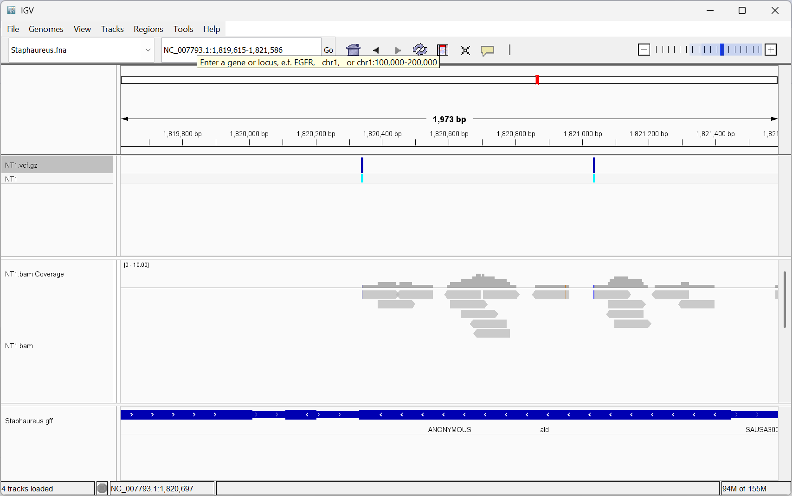

# Assignment for Week 10

## About the Makefile and README

This is an updated code from the assignment from Week 9. For additional information on the Makefile, please see README files in Week 7 and Week 8. This code is updated to include generate a multisample variant call file (VCF).

## Installed relevant Makefile/tools

I ran the following command in the terminal prior to running the Makefile to download the Makefile/tools for analysis.

    bio code 

## Commands to run once

Run these commands once, as you only to download and index the reference genome once. You also only need to create the metadata.csv from the bioproject once, as this provides all of the information about the SRR numbers and sample names.

    make get_genome
    make get_bioproject
    make index_genome

## Run for each SRR and Sample

After downloading and indexing the reference genome once, only certain steps of the Makefile need to be run for each SRR and Sample. Using the design.csv, change the SRR= and SAMPLE= at the top of the Makefile to the correct names. Then, run the following commands per each sample.

    make get_srr
    make download_reads
    make fastqc
    make align
    make bam_to_bedgraph
    make bedgraph_to_bigwig
    make vcf

## Visualizing the VCF for Sample=NT1

This is the screenshot from the visualization of sample NT1 (no treat replicate 1). There are two variants present, indicated by the 2 blue rectangles on the VCF file.

## Merging the VCF files into a single one

I used N* for this because all of my samples started with the letter N. This would need to be editted for samples not starting with the letter N. This command merges all of the VCF files created from each sample.

    bcftools merge variants/N*.vcf.gz -O z -o variants/merged.vcf.gz

## Indexing the merged VCF file

This command merges all of the VCF files for each sample.

    bcftools index variants/merged.vcf.gz

## Visualizing the merged VCF file in IGV

This is the screenshot from the visualization of the merged VCF of the 3 untreated samples and the 3 treated samples. There are three variants shown, two in sample NT1, and one in sample NaP1.

