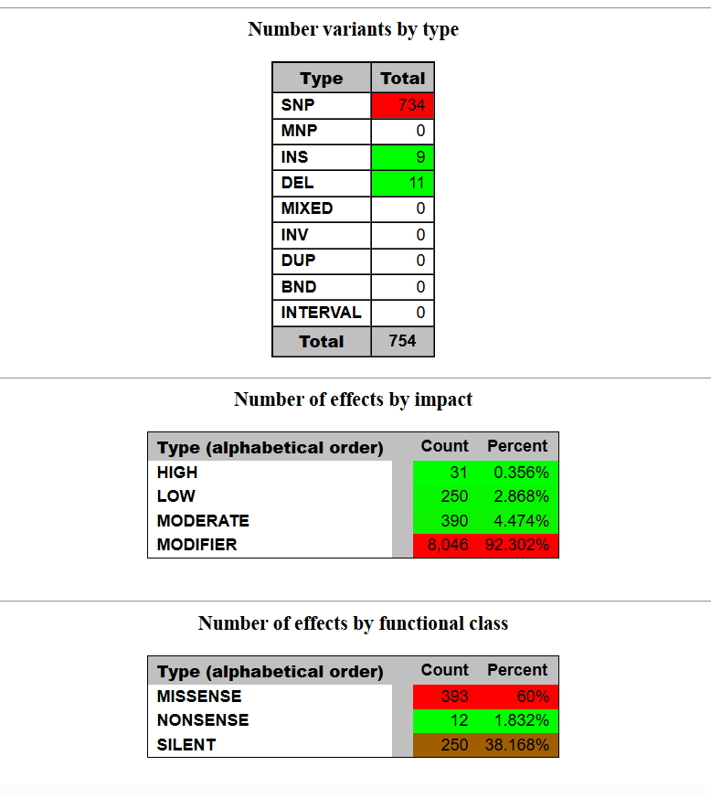
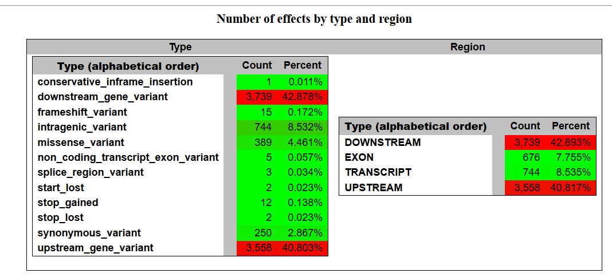

# Assignment for Week 11

## About the Makefile and README

This is an updated code from the assignment from Week 10. This code is updated to establish the effects of variants using snpEff.

## Installed relevant Makefile/tools

I ran the following command in the terminal prior to running the Makefile to download the Makefile/tools for analysis.

    bio code 

## Commands to run once

Run these commands once, as you only to download and index the reference genome once. You also only need to create the metadata.csv from the bioproject once, as this provides all of the information about the SRR numbers and sample names.

    make get_genome
    make get_bioproject
    make index_genome

## Run for each SRR and Sample

After downloading and indexing the reference genome once, only certain steps of the Makefile need to be run for each SRR and Sample. Using the design.csv, change the SRR= and SAMPLE= to run each sample. 

    make get_srr SRR=SRR21835898 SAMPLE=NT1

## Snpeff Troubleshooting

After running make snp_eff, I ran into an error in the terminal that said "'Staphaureus.genome' not found." I fixed this error in the terminal by typing:

     snpEff build -c snpeff.config -dataDir idx/snpEff -v Staphaureus

This fixed the error and allowed the code to run. There is likely a more elegant solution, but I did not want to edit the Makefile.

## Snpeff

When running snp_eff, the VCF file you are calling needs to be defined in the terminal. For this example, I wanted to use my merged file, so I typed:

    make snp_eff SAMPLE=merged

The same thing needs to be done when running snp_eff_run.

    make snp_eff_run SAMPLE=merged

To use a different VCF file, simply change the sample name in the terminal. 

## Effects of the Variants

After opening the html file in the browser, I was able to review the effects of the variants found on the merged file. 

There were 734 single nucleotide polymorphisms (SNPs), 9 insertions (INS), and 11 deltions (DELS). 60% of the SNPs are missense mutations, 1.8% are nonsense mutations, and 38% are silent mutations.

Based on the second screenshot, it appears that many of these variants are classified as upstream or downstream gene variants. I believe this means that they are taking place either upstream or downstream of coding regions. This would make sense, as often times mutations in coding regions can have deleterious effects on the cell -- whereas mutations outside of those regions can be better tolerated. These mutations made up 82% of the variants found combined. 

