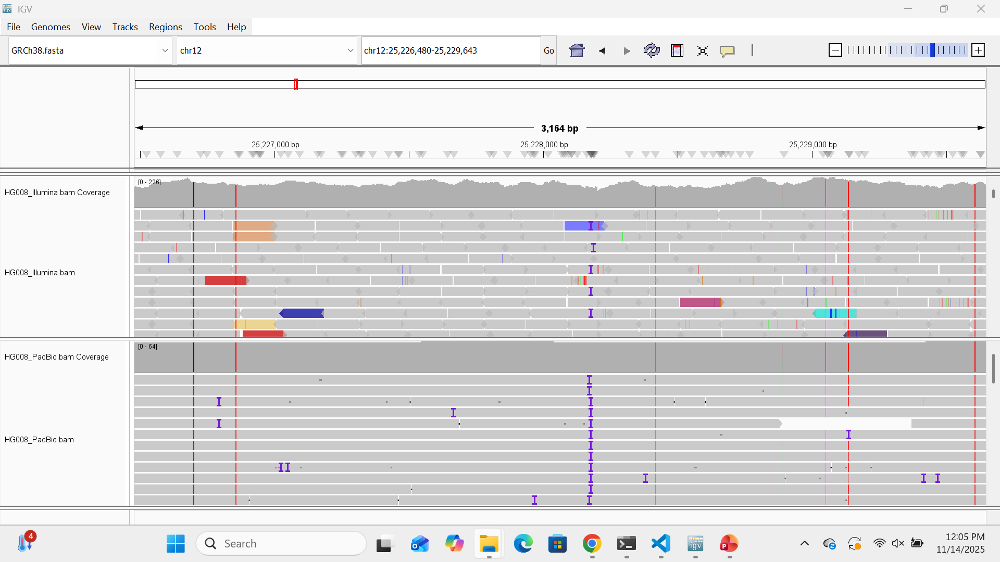

# Assignment for Week 12

## About the Makefile and README

For this assignment, I chose to do "Option 1-- Evaluate alignments across sequencing platforms." This code will allow me to compare alignment quality across different sequencing technologies from the "Cancer Genome in a Bottle" article.

I will be comparing the Illumina WGS sequencing platform to the PacBio HiFi Revio sequencing platform. 

## Get reference genome and index

The URL for the reference genome is located in the README file. To download the reference genome and index it, type:

    make get_ref
    make index_ref

## Extracting BAM files for regions of interest for Illumina and PacBio

After identifying the URLs for the BAM files, you can input those at the top of the Makefile. You can also determine a region of interest and input that as a variable in the Makefile as well.

    # Set the URL of the BAM file from Illumina sequencing
    BAM_URL_Illumina=https://ftp-trace.ncbi.nlm.nih.gov/ReferenceSamples/giab/data_somatic/HG008/Liss_lab/BCM_Illumina-WGS_20240313/HG008-N-D_Illumina_169x_GRCh38-GIABv3.bam

    # Set the URL of the BAM file from PacBio Revio sequencing
    BAM_URL_PacBio=https://ftp-trace.ncbi.nlm.nih.gov/ReferenceSamples/giab/data_somatic/HG008/Liss_lab/PacBio_Revio_20240125/HG008-N-P_PacBio-HiFi-Revio_20240125_35x_GRCh38-GIABv3.bam

Then you can run the code below to extract the reads from the BAM files for the region of interest.

    make extract_illumina
    make extract_pacbio

## Alignment stats

To generate alignment statistics for each BAM file, run the code:

    make alignment_stats

This will generate two text files, one for the Illumina BAM and one for the PacBio BAM.

For the Illumina BAM file:

    52620 + 0 in total (QC-passed reads + QC-failed reads)
    52542 + 0 primary
    0 + 0 secondary
    78 + 0 supplementary
    0 + 0 duplicates
    0 + 0 primary duplicates
    52560 + 0 mapped (99.89% : N/A)
    52482 + 0 primary mapped (99.89% : N/A)
    52542 + 0 paired in sequencing
    26332 + 0 read1
    26210 + 0 read2
    51222 + 0 properly paired (97.49% : N/A)
    52422 + 0 with itself and mate mapped
    60 + 0 singletons (0.11% : N/A)
    1112 + 0 with mate mapped to a different chr
    1091 + 0 with mate mapped to a different chr (mapQ>=5)

For the PacBio BAM file:

    149 + 0 in total (QC-passed reads + QC-failed reads)
    149 + 0 primary
    0 + 0 secondary
    0 + 0 supplementary
    0 + 0 duplicates
    0 + 0 primary duplicates
    149 + 0 mapped (100.00% : N/A)
    149 + 0 primary mapped (100.00% : N/A)
    0 + 0 paired in sequencing
    0 + 0 read1
    0 + 0 read2
    0 + 0 properly paired (N/A : N/A)
    0 + 0 with itself and mate mapped
    0 + 0 singletons (N/A : N/A)
    0 + 0 with mate mapped to a different chr
    0 + 0 with mate mapped to a different chr (mapQ>=5)

When comparing the differences in alignment statistics, we can see that there are more reads for the Illumina sequencing than for PacBio, which makes sense as Illumina is short-read sequencing. PacBio is long-read sequencing, so fewer reads are needed overall. The Illumina sequencing has 78 supplementary reads, whereas there are 0 in PacBio. Illumina is paired-end sequencing which is why we have values for the paired in sequencing, read1, and read2, whereas PacBio is single molecule sequencing. Overall, the percent mapping is very high for both. The percent mapping for Illumina is ~99.89% and for PacBio it is 100%.

## Comparing read depth between Illumina and PacBio

To compare the read depth between Illumina and PacBio, run the code below.

    make compare_depth

Output: 

    Calculating average read depth for Illumina BAM file
    Average depth: 171.12
    Calculating average read depth for PacBio BAM file
    Average depth: 29.707

Based on this, the average depth for Illumina was ~171 and PacBio was ~30. This makes sense, as Illumina WGS uses more short reads giving very dense coverage across the genome. PacBio produces fewer reads that are much longer, leading to less depth. 

# IGV Viewing

In IGV, load the unzipped FASTA file for genome, as well as the two BAM files. Make sure to set the coordinates to the region of interest (REGION=chr12:25,205,246-25,250,936).

In the screenshot from IGV, you can see the differences between the BAM files.

For the Illumina sequencing, there are more short reads that are densely stacked. These reads run in both the forward and reverse direction because this is paired-end sequencing. In PacBio, there are fewer reads that are longer meaning that fewer reads are required to cover the region of interest.

There are more mismtaches (denoted by the colored lines) captured by the Illumina sequencing than the PacBio. The mismatches are also more consistent between tracks in the PacBio. Many of the mismatches in the Illumina appear to be clustered towards the ends of the reads, which makes sense, as base quality tends to drop with read length. There is a mismatch that is captured in the same location by both Illumina and PacBio, indicating that this variant is real.

In the PacBio sequencing, there are less mismatches overall, but more insertions. Since the reads are longer, there is a greater chance of catching the insertions through sequencing in PacBio than Illumina. These insertions appear to be at roughly the same spot, which leads me to believe the insertion is real. Due to the shorter read length in Illumina, this insertion was not captured as well. 

