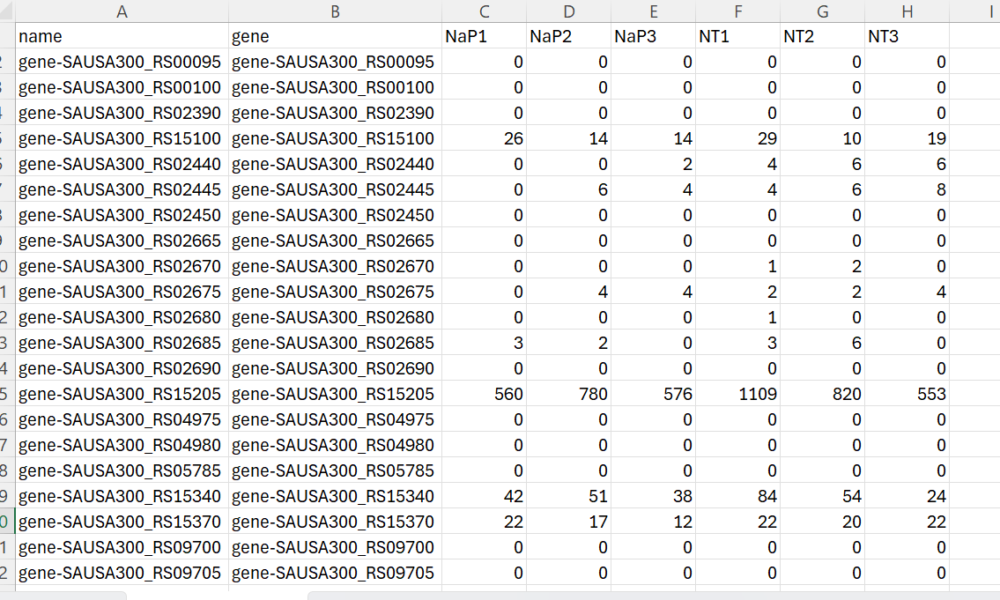
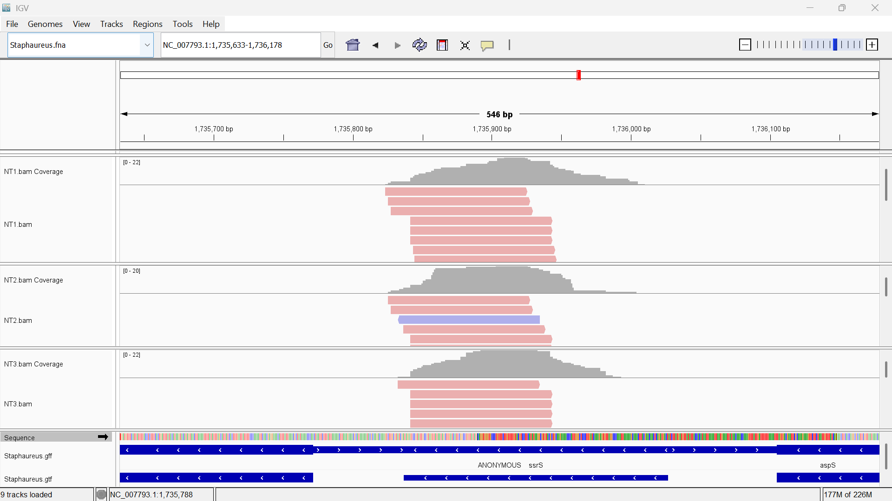
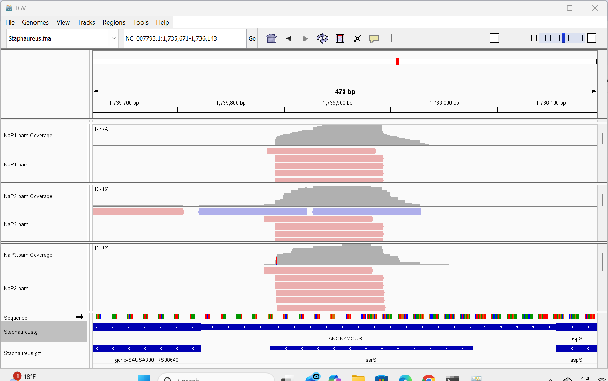

# Assignment for Week 13

## About the Makefile and README

This assignment builds upon the code in Week 9. For simplicity, I copied the running instructions below, as well as included any additions to the code. This code is updated to create a count matrix that summarizes the read counts for each dataset.  

## Downloading the Reference Genome and Bioproject and Indexing(run once)
   
    make get_genome
    make gff_to_gtf
    make get_bioproject
    make index_genome

## Running a Single Sample

To run the Makefile for a single sample, input the code as shown below. The design.csv can be used to identify which sample names correspond to each SRR number. 

    make get_srr SRR=SRR21835898 SAMPLE=NT1

This process can be repeated for the other steps within the Makefile. These steps will name the files based on the sample name, instead of the SRR number.

## Feature counts and count matrix 

The following two lines of code were added to determine feature counts and produce a count matrix per sample.

    make feature_counts
    make count_matrix

## Count matrix 

The screenshot below shows the combined count matrices of the three no treatment samples (NT1-3) and the three treated samples (NaP1-3). From this screenshot, we can see 4 genes with relatively consistent levels of gene expression: gene-SAUSA300_RS15100, gene-SAUSA300_RS15205, gene-SAUSA300_RS15340, and gene-SAUSA300_RS15370. There are other genes not shown in this screenshot that do have similar levels of expression. 

## Viewing in IGV

The IGV screenshots below capture the no treatment samples (NT1-3) and the treated samples (NaP1-3). From these images, we can determine that this is an RNA-seq dataset because the expression matches the gene boundaries. By this, I mean that there is coverage where the gene is, and no coverage outside of the boundaries. If this was a DNA sequencing dataset, that coverage would be more levelled out across the entire genome, not just where the gene boundaries are.

Additionally, there are differences in the expression profiles between the samples. While the expression levels are similar between the replicates, there are still some differences. This highlights slightly different transcript levels of the gene. We would not expect to see this difference in a DNA sequencing dataset, where the coverage should be almost identical between samples because the genomic DNA should not vary between replicates/conditions. 

