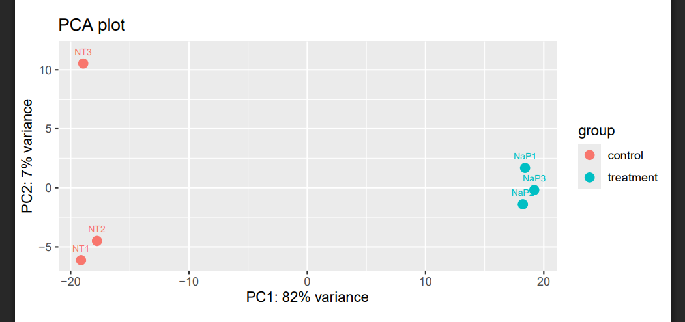
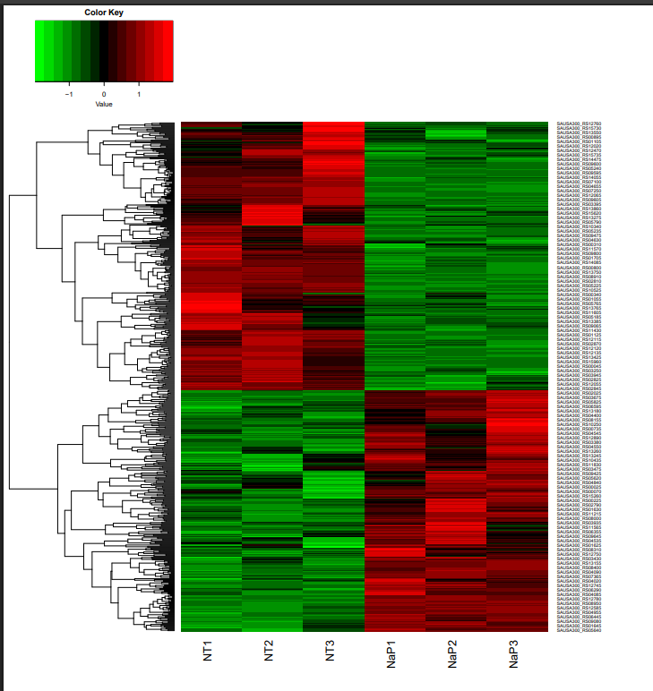
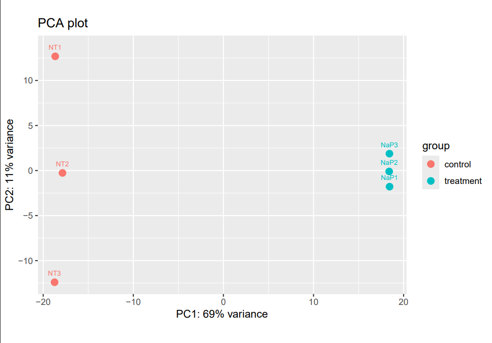

# Assignment for Week 14

## About the Makefile and README

This Makefile and README looks at an RNA-sequencing dataset from Staphylococcus aureus. The commands in the Makefile can be run for each SRR/sample to obtain counts data, determine differentially expressed genes, as well as generate a PCA plot and heatmap.

## Generating Counts Data

By running the commands below for each SRR and sample, I was able to create one count matrix per SRR/sample combination. I copied and pasted the column with the counts into one csv file titled "counts.csv."

    make feature_counts
    make format_counts

Using the counts.csv file, I was able to process that through edgeR to determine a p-value and the false discovery rate (FDR). 

Run the command:

    make process_counts

This is the output:

    Processing count matrix using edgeR
    # Initializing edgeR tibble dplyr tools ... done
    # Tool: edgeR
    # Design: design.csv
    # Counts: counts.csv
    # Sample column: sample
    # Factor column: group
    # Factors: control treatment
    # Group control has 3 samples.
    # Group treatment has 3 samples.
    # Method: glm
    # Input: 2811 rows
    # Removed: 1481 rows
    # Fitted: 1330 rows
    # Significant PVal:  659 ( 49.50 %)
    # Significant FDRs:  567 ( 42.60 %)
    # Results: edger.csv

From these results, it can be determined that 659 genes were significant based on unadjusted p-values. Whereas 567 genes, or about 42.6% of the tested genes, were identified as significantly differentially expressed between the control and treatment conditions. These results indicate that there is a significant transcriptional change between the control and treatment conditions.

## Principle Component Analysis (PCA)

Using the edger.csv file, we can generate a PCA plot by running the command:

    make generate_pca

PCA plots will position samples based on their gene expression profile. Samples that cluster close together have similar expression patterns, wheras samples that are farther apart are more transcriptionally distinct.

Based on the PCA plot shown below, we can see that the control samples (no treatment (NT1-3)) cluster to the left, and the samples treated with sodium propionate (NaP1-3) cluster to the right. In general, this indicates that there are transcriptional differences between the control and treated samples. Additionally, the replicates within each condition also cluster closely together. The replicates remain more similar to one another than the samples from the opposite condition, which suggests that the difference in transcription is likely due to treatment state. Sample NT3 is a bit of an outlier; however, it still clusters to the left side of the chart. 

## Heat Map

By running the command shown below, I was able to generate a heat map of the data.

    make generate_heatmap

The heatmap shows only the differentially expressed genes. We expect to see uniform red or green blocks that show the data is reliable between the replicates of each condition as well as differences between the treatment groups. The heatmap below shows that the no treatment samples (NT1-3) have the same general pattern, where the genes shown on the bottom have lower expression (green) and the genes on the top have higher expression (red). This pattern is reversed in the treated samples (NaP1-3). From this, we can determine that the genes are differentially expressed between the control and treated groups. 

## Identifying Differentially Expressed Genes

To identify differentially expressed genes use the command shown below.

    make differential_expression

This results in the list of genes shown below.

    name
    SAUSA300_RS01370
    SAUSA300_RS08885
    SAUSA300_RS05720
    SAUSA300_RS01365
    SAUSA300_RS13060
    SAUSA300_RS09360
    SAUSA300_RS12780
    SAUSA300_RS04085
    SAUSA300_RS03675

Due to the annotation and naming convention of these genes, none of the available gene ontology software would work (DAVID, EggNOG, Panther, etc.) What I had to do was go to Ensembl Bacteria and download the FASTA and GFF3 file from there, and repeat certain steps of the analysis to determine feature counts and differentially expressed genes.

## Ensembl PCA and Differentially Expressed Genes

To run all of the codes associated with the Ensembl data, you can run: 

    make get_ensembl_fasta
    make unzip_ensembl_fasta
    make get_ensembl_gff
    make unzip_ensembl_gff
    make index_ensembl_genome
    make align_ensembl
    make feature_counts_ensembl
    make format_ensembl_counts
    make process_ensembl_counts
    make differential_expression_ensembl
    make generate_ensembl_pca

 I also regenerated the PCA plot to verify that the samples were grouped similarly, and they are. There seems to be slightly more variation between the no treatment (NT1-3) groups; however, in general the clustering indicates a difference between the no treatment and treated samples. 

After running the make differential_expression_ensembl, I obtained this list of differentially expressed genes:

    ENSB:O8cFsNVn-AOhAka
    ENSB:3j5CatqyUbyE_RJ
    ENSB:ORJr3f5Oc2q8UlJ
    ENSB:TdSUffZ62X05q_0
    ENSB:L76Ibya6B4Z_ELi
    ENSB:CaRScD0kNwjveno
    ENSB:XseMLxqqatMjUI7
    ENSB:IsEgNezXK0ZAyVR
    ENSB:Ujsrcn-GdePJHcP

